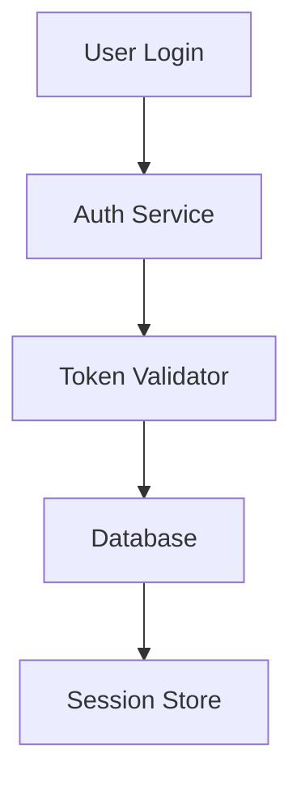
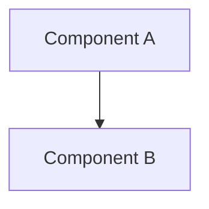
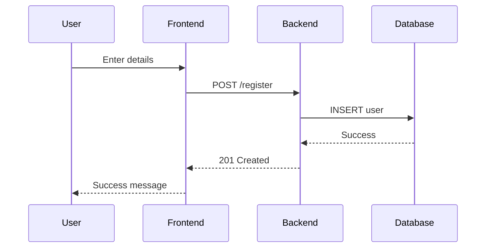

# Mermaid Diagram Template for Code Documentation

This template defines the standard format for creating Mermaid diagrams that document codebases. These diagrams include rich metadata that can be used by the Mermaid React Flow Obsidian plugin to create interactive, linked documentation.

## Template Format

### Diagram Header (Required)
Every diagram should start with metadata comments:

```mermaid
%% @diagram-title: Short descriptive title
%% @diagram-description: Longer description of what this diagram shows
%% @diagram-type: architecture | flow | sequence | component
%% @created: YYYY-MM-DD
%% @updated: YYYY-MM-DD
```

### Node Metadata (Optional but Recommended)
Each node can have associated metadata defined after the diagram structure:

```mermaid
%% @node: NodeID
%% @label: Display name for the node
%% @file: relative/path/to/file.ts
%% @line: 123
%% @type: component | function | class | module | file
%% @description: What this component does
%% @notes: Additional context, gotchas, or important information
```

### Edge Metadata (Optional)
Edges can have metadata too:

```mermaid
%% @edge: NodeA -> NodeB
%% @description: Explains the relationship between nodes
%% @type: imports | calls | extends | uses | depends-on
```

## Complete Example



## Field Definitions

### Diagram-Level Fields

| Field | Required | Description |
|-------|----------|-------------|
| `@diagram-title` | Yes | Short, descriptive title (max 100 chars) |
| `@diagram-description` | No | Detailed description of the diagram's purpose |
| `@diagram-type` | No | Category: architecture, flow, sequence, component, data-flow |
| `@created` | No | Date diagram was created (YYYY-MM-DD) |
| `@updated` | No | Date diagram was last updated (YYYY-MM-DD) |
| `@repo` | No | GitHub repository URL |
| `@base-path` | No | Base path for relative file paths |

### Node-Level Fields

| Field | Required | Description |
|-------|----------|-------------|
| `@node` | Yes | Node ID (must match ID in diagram) |
| `@label` | No | Human-readable label (overrides diagram label) |
| `@file` | No | Relative path to source file |
| `@line` | No | Line number in file where definition starts |
| `@type` | No | component, function, class, module, file, service, database |
| `@description` | No | What this node represents |
| `@notes` | No | Additional context, warnings, or important information |
| `@url` | No | External URL for documentation |
| `@dependencies` | No | Comma-separated list of dependencies |
| `@complexity` | No | low, medium, high |
| `@status` | No | active, deprecated, experimental, planned |

### Edge-Level Fields

| Field | Required | Description |
|-------|----------|-------------|
| `@edge` | Yes | Edge definition (e.g., "A -> B") |
| `@description` | No | Explains the relationship |
| `@type` | No | imports, calls, extends, uses, depends-on, sends, receives |
| `@async` | No | true/false - is this an async operation? |
| `@protocol` | No | HTTP, WebSocket, gRPC, etc. |

## Usage with Claude Code

When asking Claude Code to generate a Mermaid diagram, reference this template:

**Example Prompt:**
```
Using the MERMAID_TEMPLATE.md format, create a Mermaid diagram that shows
the architecture of the authentication system. Include file paths and
line numbers for all components.
```

Claude Code will:
1. Analyze the codebase
2. Create a diagram following this template
3. Add metadata with actual file paths and line numbers
4. Include descriptions based on code analysis

## Plugin Integration

The Mermaid React Flow Obsidian plugin will:
- Parse all metadata from comments
- Display file paths as clickable links (using Obsidian's URI scheme)
- Show descriptions in tooltips or info panels
- Highlight nodes by type with different colors
- Add status badges (deprecated, experimental, etc.)
- Provide "Go to definition" functionality

## Best Practices

### 1. Use Consistent Node IDs
- Use descriptive IDs: `AuthService` not `A`
- Match naming to actual code: `UserController` for UserController class

### 2. Keep Diagrams Focused
- One diagram = one concept/flow/subsystem
- Break large systems into multiple diagrams
- Link related diagrams using `@related-diagram` metadata

### 3. Update Metadata When Code Changes
- Keep file paths and line numbers current
- Update `@updated` date when making changes
- Add `@status: deprecated` when code is deprecated

### 4. Add Context in Notes
```mermaid
%% @node: PaymentProcessor
%% @notes: Uses Stripe API; requires STRIPE_SECRET_KEY env var; retries failed payments 3x
```

### 5. Document Dependencies
```mermaid
%% @node: EmailService
%% @dependencies: nodemailer, handlebars, mjml
```

## Template Variations

### Quick Diagram (Minimal Metadata)


### Comprehensive Diagram (Full Metadata)
Include all fields for critical/complex systems

### Sequence Diagram Format


## File Path Conventions

### Absolute Paths
```mermaid
%% @file: /Users/james/project/src/file.ts
```

### Relative Paths (Recommended)
```mermaid
%% @base-path: /Users/james/project
%% @file: src/file.ts
```

### GitHub URLs
```mermaid
%% @repo: https://github.com/user/repo
%% @file: src/file.ts
%% @line: 45
%% Will create: https://github.com/user/repo/blob/master/src/file.ts#L45
```

## Validation

Valid metadata must:
- Use `%%` comment syntax
- Use `@field: value` format
- Have no spaces before `@`
- Match node/edge IDs exactly as they appear in diagram
- Use valid ISO date format (YYYY-MM-DD)

## Examples by Type

### Architecture Diagram
Shows high-level system components and their relationships

### Flow Diagram
Shows step-by-step process or algorithm flow

### Component Diagram
Shows relationships between code modules/classes

### Sequence Diagram
Shows interactions over time between components

### Data Flow Diagram
Shows how data moves through the system
