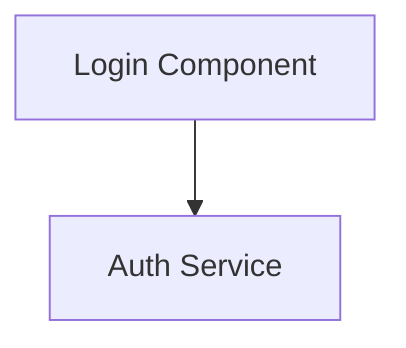

# Metadata Feature Summary

## What We Built

Your Obsidian plugin now supports **rich metadata** in Mermaid diagrams, allowing you to create interactive, documentation-linked diagrams that connect directly to your source code.

## Key Components

### 1. Metadata Template (`MERMAID_TEMPLATE.md`)
A comprehensive specification for adding metadata to Mermaid diagrams that Claude Code can reference when generating diagrams. The template defines:

**Diagram-level metadata:**
- Title, description, type
- Repository URL
- Creation/update dates
- Base path for relative files

**Node-level metadata:**
- File path and line number
- Type (component, function, class, etc.)
- Description and notes
- Dependencies
- Complexity level
- Status (active, deprecated, experimental, planned)

**Edge-level metadata:**
- Relationship description
- Type (imports, calls, extends, etc.)
- Async flag
- Protocol

### 2. Metadata Parser (`src/obsidian-plugin/metadataParser.ts`)
Parses metadata from Mermaid comments and provides utilities:
- Extracts all `%% @field: value` metadata
- Constructs file URIs (GitHub links or Obsidian URIs)
- Provides visual styling (colors, icons) based on node types
- Supports status badges

### 3. Metadata Panel (`src/obsidian-plugin/MetadataPanel.tsx`)
Interactive info panel that displays:
- Diagram information (title, description, repo link)
- Selected node details (file, line, description, notes)
- Clickable file links that open in GitHub or Obsidian
- Visual badges for type, status, and complexity
- Dependencies list

### 4. Example Diagram (`ARCHITECTURE_DIAGRAM.md`)
A complete, documented example of this project's architecture using the metadata format.

## How It Works

### For Diagram Authors

1. **Add metadata to your Mermaid diagrams:**


2. **Import into Obsidian:**
   - Create a markdown file with your Mermaid diagram
   - Click "View in React Flow" button
   - Diagram opens in the sidebar

3. **Interact with metadata:**
   - Info panel shows diagram details (collapsed by default)
   - Click any node to see its metadata
   - Click file links to open in GitHub or jump to code in Obsidian
   - See visual badges for node types and status

### With Claude Code

When you need to understand complex code:

1. **Ask Claude Code to generate a diagram:**
```
Using MERMAID_TEMPLATE.md, create a Mermaid diagram showing
the authentication flow in this codebase. Include file paths
and line numbers for all components.
```

2. **Claude Code will:**
   - Analyze the codebase
   - Find relevant files and functions
   - Create a diagram with full metadata
   - Include accurate file paths and line numbers
   - Add descriptions based on code analysis

3. **You get:**
   - Visual diagram of the system
   - Clickable links to every component
   - Documentation embedded in the diagram
   - A reference you can update as code changes

## Features

### Interactive File Links
- **GitHub repos:** Links open files at specific lines on GitHub
- **Local files:** Obsidian URIs open files directly in your vault
- Works with both absolute and relative paths

### Visual Indicators
- **Node types:** Different colors and icons (⚛️ for components, 📦 for modules, etc.)
- **Status badges:** Color-coded status (active=green, deprecated=red, experimental=orange)
- **Complexity:** Visual indicator for low/medium/high complexity

### Auto-Refresh
- Diagrams automatically update when you edit the source markdown
- Manual reload button available as fallback
- Toggle auto-refresh on/off

### Position Persistence
- Custom node positions are saved per diagram
- Reset button restores auto-layout positions

## Example Use Cases

### 1. Understanding a New Codebase
Ask Claude Code:
```
Analyze the authentication system and create a diagram using
MERMAID_TEMPLATE.md showing how login, token validation, and
session management work together.
```

Result: Interactive diagram with links to every file in the auth flow.

### 2. Documenting Your Architecture
Create diagrams that:
- Link to implementation files
- Include technical notes and gotchas
- Show dependencies clearly
- Track status (what's deprecated, experimental, etc.)

### 3. Onboarding New Developers
Provide diagrams that:
- Explain system architecture visually
- Link directly to code for deeper investigation
- Include context and notes
- Show complexity levels to guide learning

### 4. Code Review Reference
During reviews:
- Quickly see how changes affect architecture
- Verify links between components
- Check if deprecated code is still referenced

## File Structure

```
mermaid-to-reactflow/
├── MERMAID_TEMPLATE.md          # Template specification
├── ARCHITECTURE_DIAGRAM.md      # Example using this project
├── src/
│   └── obsidian-plugin/
│       ├── metadataParser.ts    # Parsing logic
│       ├── MetadataPanel.tsx    # UI component
│       └── ReactFlowDiagramWrapper.tsx  # Integration
```

## Tips for Best Results

### When Asking Claude Code to Generate Diagrams

**✅ Good prompts:**
- "Create a diagram showing the data flow through the API layer"
- "Diagram the component hierarchy for the dashboard feature"
- "Show how error handling works across the application"

**Include specifics:**
- Reference MERMAID_TEMPLATE.md
- Specify which part of the codebase to focus on
- Request specific metadata (file paths, dependencies, etc.)

### Maintaining Diagrams

1. **Update dates:** Change `@updated` when modifying diagrams
2. **Mark deprecated:** Add `@status: deprecated` to outdated components
3. **Keep line numbers current:** If code moves, update `@line` values
4. **Add notes:** Document gotchas and important context

### Organizing Diagrams

Create separate diagrams for:
- Overall architecture (high-level)
- Individual subsystems (detailed)
- Specific flows (authentication, payment, etc.)
- Data models and relationships

## Next Steps

1. **Try the example:** Open `ARCHITECTURE_DIAGRAM.md` in Obsidian and click "View in React Flow"

2. **Generate a diagram:** Ask Claude Code to create a diagram of a complex part of your codebase

3. **Customize it:** Add notes, update metadata, adjust layout

4. **Share it:** Commit diagrams to your repo for team reference

## Advanced Features

### GitHub Integration
Set `@repo` in diagram metadata to create GitHub links:
```mermaid
%% @repo: https://github.com/your/repo
%% @base-path: /full/local/path

%% @node: A
%% @file: src/file.ts
%% @line: 45
%% Opens: https://github.com/your/repo/blob/master/src/file.ts#L45
```

### Local Obsidian URIs
Without `@repo`, creates Obsidian URIs for local navigation:
```mermaid
%% @base-path: /Users/you/project

%% @node: A
%% @file: src/file.ts
%% Opens file in Obsidian
```

### External Documentation
Link to external docs:
```mermaid
%% @node: A
%% @url: https://docs.example.com/component-a
%% Shows "Documentation" link in metadata panel
```

## Troubleshooting

**Links don't work:**
- Check `@repo` URL is correct
- Verify `@base-path` points to project root
- Ensure file paths are relative to base-path

**Metadata not showing:**
- Check comment syntax: `%% @field: value`
- No spaces before `@`
- Node ID must match exactly

**Panel not appearing:**
- Click the ℹ️ icon in top-right to expand
- Click a node to see node-specific metadata

## Future Enhancements (Ideas)

- Search/filter nodes by metadata
- Export diagrams with metadata to other formats
- Bulk update line numbers when code changes
- Dependency graph visualization
- Integration with LSP for real-time metadata
